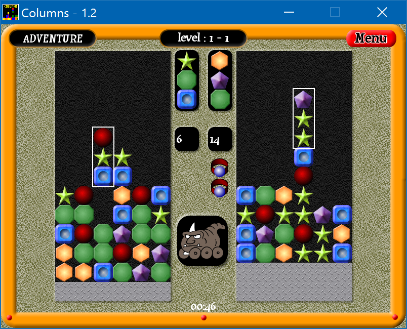

# Columns

Columns written using C++ and the PopCap Games Framework (SexyAppFramework) between March 2008 to November 2008. Repository created from archived code.

The game is based on Columns and Columns III released on the Sega Megadrive. Some graphics, sound and music used is from those games along with my own graphics created in Macromedia Fireworks.

